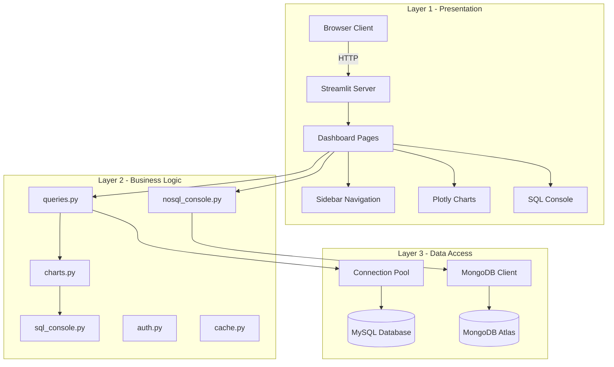
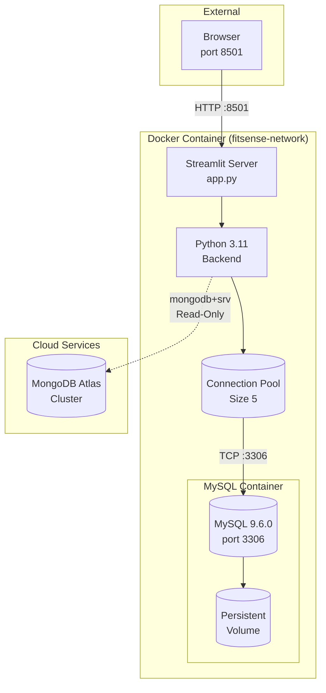
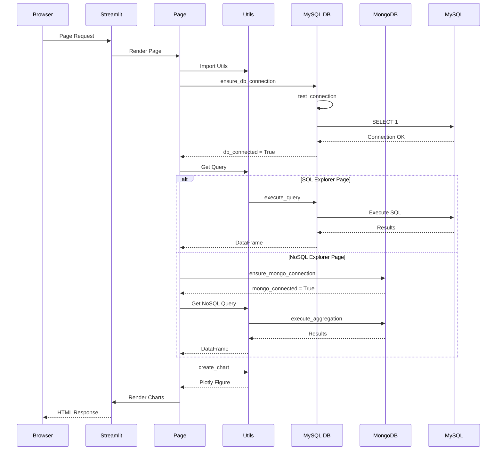
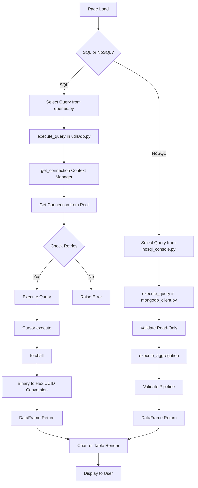
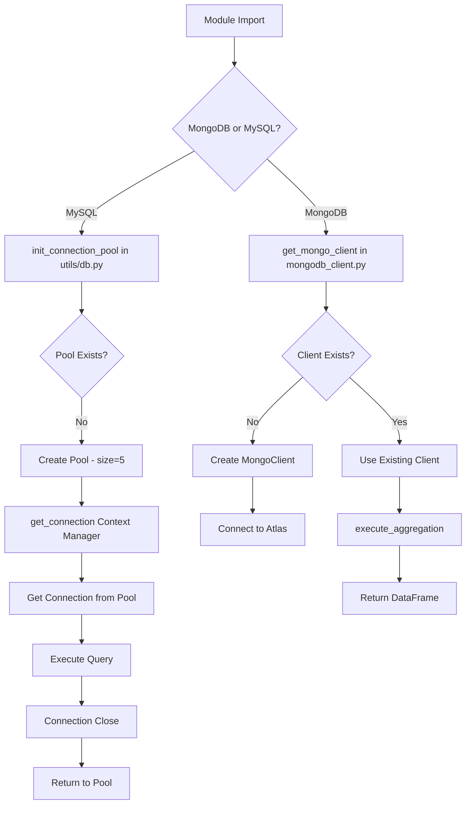
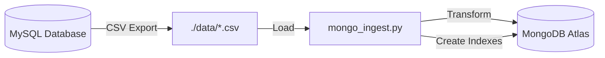

# FitSense AI Dashboard

[](https://fitsense-dashboard.abhinavdev24.com)
[](https://www.python.org/)
[](https://streamlit.io/)
[](https://www.mysql.com/)
[](https://www.mongodb.com/atlas)
[](https://www.docker.com/)
[](LICENSE)

A production-ready Streamlit-based data analysis dashboard for the FitSense AI MySQL database.

## Features

- **8 Dashboard Pages**: Overview, Workouts, Nutrition, Sleep, Weight, Users, SQL Explorer, and NoSQL Explorer
- **Dual Database Support**: MySQL for transactional data, MongoDB Atlas for aggregation analytics
- **Interactive Visualizations**: Plotly-based charts with dark theme
- **SQL Query Console**: Execute custom queries with syntax highlighting
- **NoSQL Explorer**: Interactive MongoDB aggregation query builder with 30+ predefined queries
- **Authentication**: Google OAuth integration with demo mode
- **Performance Optimized**: Caching, connection pooling, and lazy loading
- **Mobile Responsive**: Works on desktop and tablet devices
- **Read-Only Security**: MongoDB operations are restricted to read-only for data protection

## Architecture

The FitSense AI Dashboard follows a three-tier architecture pattern:



## Database Schema

The MySQL database contains 25 tables organized into 9 domains:

```mermaid
erDiagram
    users {
        int user_id "PK"
        varchar name "username"
        varchar email "email address"
        datetime created_at "creation timestamp"
    }
    user_profiles {
        int user_id "PK, FK"
        date date_of_birth "birth date"
        varchar sex "gender"
        decimal height_cm "height in cm"
        varchar activity_level "activity level"
        datetime updated_at "last update"
    }
    user_medical_profiles {
        int medical_profile_id "PK"
        int user_id "FK"
        tinyint has_injuries "has injuries"
        text injury_details "injury details"
        text surgeries_history "surgeries history"
        text family_history "family history"
        text notes "notes"
        datetime updated_at "last update"
    }
    user_medications {
        int medication_id "PK"
        int user_id "FK"
        varchar medication_name "medication name"
        varchar dosage "dosage"
        varchar frequency "frequency"
        date start_date "start date"
        date end_date "end date"
        text notes "notes"
    }
    user_allergies {
        int allergy_id "PK"
        int user_id "FK"
        varchar allergen "allergen"
        varchar reaction "reaction"
        varchar severity "severity"
        text notes "notes"
    }
    goals {
        int goal_id "PK"
        varchar name "goal name"
        text description "goal description"
    }
    user_goals {
        int user_id "PK, FK"
        int goal_id "PK, FK"
        tinyint priority "goal priority"
    }
    conditions {
        int condition_id "PK"
        varchar name "condition name"
        text description "condition description"
    }
    user_conditions {
        int user_id "PK, FK"
        int condition_id "PK, FK"
        varchar severity "condition severity"
        text notes "notes"
    }
    equipment {
        int equipment_id "PK"
        varchar name "equipment name"
        varchar category "equipment category"
    }
    exercises {
        int exercise_id "PK"
        varchar name "exercise name"
        varchar primary_muscle "primary muscle group"
        text notes "exercise notes"
        varchar video_url "video URL"
        text thumbnail_base64 "thumbnail"
    }
    exercise_equipment {
        int exercise_id "PK, FK"
        int equipment_id "PK, FK"
    }
    workout_plans {
        int plan_id "PK"
        int user_id "FK"
        varchar name "plan name"
        boolean is_active "is active"
        datetime created_at "creation timestamp"
    }
    plan_days {
        int plan_day_id "PK"
        int plan_id "FK"
        varchar name "day name"
        tinyint day_order "day order"
        text notes "notes"
    }
    plan_exercises {
        int plan_exercise_id "PK"
        int plan_day_id "FK"
        int exercise_id "FK"
        smallint position "position"
        text notes "notes"
    }
    plan_sets {
        int plan_set_id "PK"
        int plan_exercise_id "FK"
        tinyint set_number "set number"
        tinyint target_reps "target reps"
        decimal target_weight "target weight"
        tinyint target_rir "target RIR"
        smallint rest_seconds "rest seconds"
    }
    workouts {
        int workout_id "PK"
        int user_id "FK"
        int plan_id "FK"
        int plan_day_id "FK"
        datetime started_at "start time"
        datetime ended_at "end time"
        text notes "notes"
    }
    workout_exercises {
        int workout_exercise_id "PK"
        int workout_id "FK"
        int exercise_id "FK"
        int plan_exercise_id "FK"
        smallint position "position"
        text notes "notes"
    }
    workout_sets {
        int workout_set_id "PK"
        int workout_exercise_id "FK"
        tinyint set_number "set number"
        tinyint reps "repetitions"
        decimal weight "weight used"
        tinyint rir "RIR"
        boolean is_warmup "is warmup"
        datetime completed_at "completed timestamp"
    }
    ai_interactions {
        int ai_interaction_id "PK"
        int user_id "FK"
        varchar context_type "context type"
        int context_id "context ID"
        text query_text "query text"
        text response_text "response text"
        varchar model_name "model name"
        datetime created_at "creation timestamp"
    }
    calorie_targets {
        int calorie_target_id "PK"
        int user_id "FK"
        int maintenance_calories "maintenance calories"
        varchar method "calculation method"
        date effective_from "effective from"
        date effective_to "effective to"
        text notes "notes"
        datetime created_at "creation timestamp"
    }
    calorie_intake_logs {
        int calorie_log_id "PK"
        int user_id "FK"
        date log_date "log date"
        int calories_consumed "calories consumed"
        text notes "notes"
        datetime created_at "creation timestamp"
    }
    sleep_targets {
        int sleep_target_id "PK"
        int user_id "FK"
        decimal target_sleep_hours "target sleep hours"
        date effective_from "effective from"
        date effective_to "effective to"
        text notes "notes"
        datetime created_at "creation timestamp"
    }
    sleep_duration_logs {
        int sleep_log_id "PK"
        int user_id "FK"
        date log_date "log date"
        decimal sleep_duration_hours "sleep hours"
        text notes "notes"
        datetime created_at "creation timestamp"
    }
    weight_logs {
        int weight_log_id "PK"
        int user_id "FK"
        datetime logged_at "log timestamp"
        decimal weight_kg "weight in kg"
        decimal body_fat_percentage "body fat %"
        text notes "notes"
    }

    users ||--|| user_profiles : "1:1"
    users ||--|| user_medical_profiles : "1:1"
    users ||--o{ user_medications : "1:N"
    users ||--o{ user_allergies : "1:N"
    users ||--o{ user_goals : "1:N"
    users ||--o{ user_conditions : "1:N"
    users ||--o{ workout_plans : "1:N"
    users ||--o{ workouts : "1:N"
    users ||--o{ ai_interactions : "1:N"
    users ||--o{ calorie_targets : "1:N"
    users ||--o{ calorie_intake_logs : "1:N"
    users ||--o{ sleep_targets : "1:N"
    users ||--o{ sleep_duration_logs : "1:N"
    users ||--o{ weight_logs : "1:N"
    goals ||--o{ user_goals : "1:N"
    conditions ||--o{ user_conditions : "1:N"
    exercises ||--o{ exercise_equipment : "1:N"
    equipment ||--o{ exercise_equipment : "1:N"
    workout_plans ||--o{ plan_days : "1:N"
    plan_days ||--o{ plan_exercises : "1:N"
    exercises ||--o{ plan_exercises : "1:N"
    plan_exercises ||--o{ plan_sets : "1:N"
    workouts ||--o{ workout_exercises : "1:N"
    exercises ||--o{ workout_exercises : "1:N"
    plan_exercises ||--o{ workout_exercises : "1:N"
    workout_exercises ||--o{ workout_sets : "1:N"
```



## MongoDB Collections

|  #  | Collection            | Index                     | Description                       |
| :-: | :-------------------- | :------------------------ | :-------------------------------- |
|  1  | users                 | email                     | User accounts                     |
|  2  | goals                 | name                      | Fitness goals                     |
|  3  | conditions            | name                      | Medical conditions                |
|  4  | equipment             | name                      | Exercise equipment                |
|  5  | exercises             | name                      | Exercise library                  |
|  6  | user_goals            | user_id, goal_id          | User-goal associations            |
|  7  | user_conditions       | user_id, condition_id     | User-condition associations       |
|  8  | exercise_equipment    | exercise_id, equipment_id | Exercise-equipment associations   |
|  9  | workout_plans         | user_id                   | Workout plan templates            |
| 10  | plan_days             | plan_id                   | Days within workout plans         |
| 11  | plan_exercises        | plan_day_id, exercise_id  | Exercises within plan days        |
| 12  | plan_sets             | plan_exercise_id          | Target sets for planned exercises |
| 13  | workouts              | user_id, started_at       | Completed workout sessions        |
| 14  | workout_exercises     | workout_id                | Exercises within workouts         |
| 15  | workout_sets          | workout_exercise_id       | Actual sets performed             |
| 16  | ai_interactions       | user_id, created_at       | AI chatbot conversations          |
| 17  | user_profiles         | user_id                   | User demographics                 |
| 18  | user_medical_profiles | user_id                   | Medical history                   |
| 19  | user_medications      | user_id                   | User medications                  |
| 20  | user_allergies        | user_id                   | User allergies                    |
| 21  | calorie_targets       | user_id, effective_from   | Daily calorie goals               |
| 22  | calorie_intake_logs   | user_id, log_date         | Calorie consumption logs          |
| 23  | sleep_targets         | user_id, effective_from   | Sleep duration goals              |
| 24  | sleep_duration_logs   | user_id, log_date         | Sleep duration logs               |
| 25  | weight_logs           | user_id, logged_at        | Weight measurements               |

## Network Architecture

## Network Architecture



### Port Mappings

| Service             | Container Port | Host Port | Protocol    |
| :------------------ | :------------- | :-------- | :---------- |
| Streamlit Dashboard | 8501           | 8501      | HTTP        |
| MySQL Database      | 3306           | 3306      | TCP         |
| MongoDB Atlas       | -              | (Cloud)   | mongodb+srv |

### Database Strategy

| Database | Purpose                                   | Access Pattern  |
| :------- | :---------------------------------------- | :-------------- |
| MySQL    | Transactional data, source of truth       | CRUD operations |
| MongoDB  | Aggregation analytics, read-heavy queries | Read-only       |

Data flows from MySQL to MongoDB via the `mongo_ingest.py` script for analytics purposes.

## Quick Start

### Prerequisites

- Python 3.10+
- MySQL 8.0+ (or Docker)
- MongoDB Atlas account (for NoSQL Explorer features)
- pip

### Installation

1. **Clone the repository**

   ```bash
   cd fitsense-ai-dashboard
   ```

2. **Create virtual environment**

   ```bash
   python -m venv venv
   source venv/bin/activate  # On Windows: venv\Scripts\activate
   ```

3. **Install dependencies**

   ```bash
   pip install -r requirements.txt
   ```

4. **Configure environment**

   ```bash
   cp .env.example .env
   # Edit .env with your database credentials
   ```

5. **Set up MongoDB connection** (optional, for NoSQL Explorer)

   Add your MongoDB Atlas connection details to `.env`:

   ```bash
   MONGODB_COMMAND=mongosh "mongodb+srv://cluster0.xxxxxx.mongodb.net/" --apiVersion 1 --username your_user
   MONGODB_USER=your_username
   MONGODB_PASSWORD=your_password
   MONGODB_DATABASE=fitsense_ai
   ```

6. **Run the dashboard**
   ```bash
   streamlit run app.py
   ```

### First-Time MongoDB Setup

If using NoSQL Explorer for the first time, you'll need to ingest data from MySQL to MongoDB:

```bash
python nosql/mongo_ingest.py --reset
```

This will create indexes and populate all 25 collections.

## Docker Deployment

### Using Docker Compose (Recommended)

```bash
docker-compose up -d
```

This starts both the MySQL database and the dashboard.

**Note:** MongoDB Atlas is a cloud service and is not included in Docker. To use NoSQL Explorer features:

1. Create a MongoDB Atlas account at [mongodb.com/cloud/atlas](https://www.mongodb.com/cloud/atlas)
2. Set up environment variables in `.env`:
   ```bash
   MONGODB_COMMAND=your_mongosh_connection_string
   MONGODB_USER=your_username
   MONGODB_PASSWORD=your_password
   ```
3. Ingest data: `python nosql/mongo_ingest.py --reset`

### Using Docker Only

```bash
# Build the image
docker build -t fitsense-dashboard .

# Run with environment variables
docker run -p 8501:8501 \
  -e DB_HOST=mysql-host \
  -e DB_PORT=3306 \
  -e DB_USER=root \
  -e DB_PASSWORD=secret \
  -e DB_NAME=fitsense_ai \
  fitsense-dashboard
```

## Environment Variables

| Variable               | Description                  | Default               |
| ---------------------- | ---------------------------- | --------------------- |
| `DB_HOST`              | MySQL host                   | localhost             |
| `DB_PORT`              | MySQL port                   | 3306                  |
| `DB_USER`              | Database user                | root                  |
| `DB_PASSWORD`          | Database password            | (none)                |
| `DB_NAME`              | Database name                | fitsense_ai           |
| `MONGODB_COMMAND`      | MongoDB Atlas connection URI | (none)                |
| `MONGODB_USER`         | MongoDB username             | abhinav241998_db_user |
| `MONGODB_PASSWORD`     | MongoDB password             | (none)                |
| `MONGODB_DATABASE`     | MongoDB database name        | fitsense_ai           |
| `DEMO_MODE`            | Enable demo login            | false                 |
| `GOOGLE_CLIENT_ID`     | Google OAuth client ID       | (none)                |
| `GOOGLE_CLIENT_SECRET` | Google OAuth client secret   | (none)                |
| `DEBUG`                | Enable debug mode            | false                 |
| `DISABLE_CACHE`        | Disable query caching        | false                 |

## Project Structure

```
fitsense-ai-dashboard/
├── app.py                 # Main entry point
├── pages/                 # Dashboard pages
│   ├── 1_Overview.py
│   ├── 2_Workouts.py
│   ├── 3_Nutrition.py
│   ├── 4_Sleep.py
│   ├── 5_Weight.py
│   ├── 6_Users.py
│   ├── 7_SQL_Explorer.py
│   └── 8_NoSQL_Explorer.py     # MongoDB aggregation explorer
├── utils/                  # Utility modules
│   ├── db.py              # Database connection
│   ├── queries.py         # SQL queries
│   ├── charts.py          # Chart configurations
│   ├── sql_console.py     # SQL console
│   ├── mongodb_client.py  # MongoDB connection (read-only)
│   ├── nosql_console.py   # NoSQL query definitions
│   ├── auth.py            # Authentication
│   ├── cache.py           # Caching utilities
│   ├── error_handler.py   # Error handling
│   └── performance.py     # Performance utilities
├── nosql/                 # NoSQL utilities
│   └── mongo_ingest.py    # MongoDB data ingestion script
├── assets/
│   └── style.css          # Custom CSS
├── tests/                 # Test suite
├── NoSqlQueries.md        # MongoDB query reference documentation
├── Dockerfile
├── docker-compose.yml
└── requirements.txt
```

## Code Flow

### Request Flow



### Query Execution Flow



### Database Connection Flow



## Testing

```bash
# Run all tests
pytest

# Run with coverage
pytest --cov=. --cov-report=html

# Run specific test file
pytest tests/test_dashboard.py
```

## Data Ingestion

The `nosql/mongo_ingest.py` script synchronizes data from MySQL (CSV exports) to MongoDB Atlas:

```bash
# Ingest all collections
python nosql/mongo_ingest.py

# Ingest specific collections
python nosql/mongo_ingest.py --collections users workouts

# Reset and recreate (drops existing data)
python nosql/mongo_ingest.py --reset

# Preview without inserting
python nosql/mongo_ingest.py --dry-run

# Show existing data
python nosql/mongo_ingest.py --preview

# Provide password via CLI
python nosql/mongo_ingest.py --password your_password
```

### Data Flow



### Data Ingestion Order

The ingestion script processes collections in dependency order:

1. **Base Tables**: users, goals, conditions, equipment, exercises
2. **Junction Tables**: user_goals, user_conditions, exercise_equipment
3. **Workout Plans**: workout_plans, plan_days, plan_exercises, plan_sets
4. **Workouts**: workouts, workout_exercises, workout_sets
5. **User Data**: user_profiles, user_medical_profiles, user_medications, user_allergies
6. **Tracking**: calorie_targets, calorie_intake_logs, sleep_targets, sleep_duration_logs, weight_logs

See the [MongoDB Collections](#mongodb-collections) section for the complete list of all 25 collections.

## SQL Explorer Features

- **Predefined Queries**: Load common queries by category
- **Custom Queries**: Execute any valid SQL
- **Query History**: Track executed queries
- **Export**: Download results as CSV or JSON
- **Quick Charts**: Auto-generate visualizations

## NoSQL Explorer Features

The **NoSQL Explorer** page provides an interactive MongoDB aggregation query builder:

- **30+ Predefined Queries**: Organized into 7 categories for different use cases
- **Aggregation Pipeline Editor**: Build complex pipelines with JSON syntax
- **Query Categories**:
  - Basic Find - Simple document retrieval
  - Aggregation - Group, sum, average operations
  - Lookup (JOIN) - Cross-collection queries
  - Outer Lookup (LEFT JOIN) - Find documents with missing relations
  - Nested Aggregations - Multi-stage complex pipelines
  - Set Operations (UNION) - Combine collections
  - Subqueries - Derived columns and computed values
- **MongoDB Shell Equivalents**: View the equivalent `db.collection.aggregate()` commands
- **JSON Output**: Results displayed with syntax highlighting
- **Download**: Export query results as JSON
- **Query History**: Track recently executed queries
- **Read-Only Security**: Write operations are blocked at the application level

See the [MongoDB Collections](#mongodb-collections) section for the complete list of all 25 collections.

## MongoDB Query Categories

### Basic Find (N1-N4)

Simple queries equivalent to SQL `SELECT`:

- N1: All Users
- N2: All Exercises
- N3: All Goals
- N4: Recent Workouts

### Aggregation (A1-A8)

Queries using `$group` with accumulators, equivalent to SQL `GROUP BY`:

- A1: Users by Activity Level
- A2: Users by Sex
- A3: Average Height by Sex
- A4: Age Distribution
- A5: Workouts per Day of Week
- A6: Most Popular Goals
- A7: Conditions by Severity
- A8: Average Workout Duration

### Lookup/Join (J1-J4)

Queries using `$lookup` to join collections:

- J1: User Demographics
- J2: Most Used Exercises
- J3: Top Active Users
- J4: Users with Severe Conditions

### Outer Lookup/Left Join (O1-O3)

Find documents without related records:

- O1: Users with No Goals
- O2: Users with No Workouts
- O3: Exercises Never Used

### Nested Aggregation (NS1-NS2)

Multi-stage complex pipelines:

- NS1: Users Above Average Workouts
- NS2: Heaviest Lifts Above Average

### Set Operations/Union (U1-U3)

Combine results from multiple collections:

- U1: Collection Counts
- U2: Users with Goals OR Conditions
- U3: Combined Tracking Data

### Subqueries (SM1-SM3)

Derived columns with `$lookup`:

- SM1: User Summary
- SM2: Average Workouts Per User
- SM3: Activity Level with Percentage

## MongoDB Operator Reference

| Operator     | Description               | SQL Equivalent            |
| :----------- | :------------------------ | :------------------------ |
| `$match`     | Filter documents          | WHERE                     |
| `$group`     | Group documents           | GROUP BY                  |
| `$project`   | Shape/transform documents | SELECT (column selection) |
| `$sort`      | Order documents           | ORDER BY                  |
| `$limit`     | Limit result count        | LIMIT                     |
| `$lookup`    | Join collections          | JOIN                      |
| `$unwind`    | Deconstruct arrays        | (flattening)              |
| `$bucket`    | Create range groups       | CASE WHEN / grouping      |
| `$unionWith` | Combine collections       | UNION ALL                 |
| `$sum`       | Accumulator - sum         | SUM()                     |
| `$avg`       | Accumulator - average     | AVG()                     |
| `$count`     | Count documents           | COUNT(\*)                 |
| `$size`      | Array length              | (array check)             |

For detailed query examples and SQL equivalents, see [NoSqlQueries.md](./NoSqlQueries.md).

## Design System

The dashboard follows a dark-mode glassmorphism design:

- **Background**: #0F172A (dark slate)
- **Cards**: #1E293B with glass effect
- **Primary**: #3B82F6 (blue)
- **Secondary**: #F59E0B (amber)
- **Typography**: Inter/Roboto

## Deployment Options

### Streamlit Cloud

1. Push to GitHub
2. Connect to Streamlit Cloud
3. Set environment variables
4. Deploy

### Heroku

```bash
heroku create fitsense-dashboard
heroku container:push web
heroku container:release web
```

### AWS Elastic Beanstalk

```bash
eb init
eb create production
eb deploy
```

## Contributing

1. Fork the repository
2. Create a feature branch
3. Make your changes
4. Run tests
5. Submit a pull request

## License

MIT License - See LICENSE file for details

## Support

For issues and questions, please open a GitHub issue.
