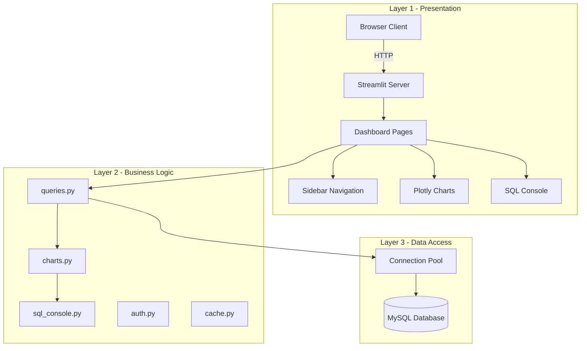
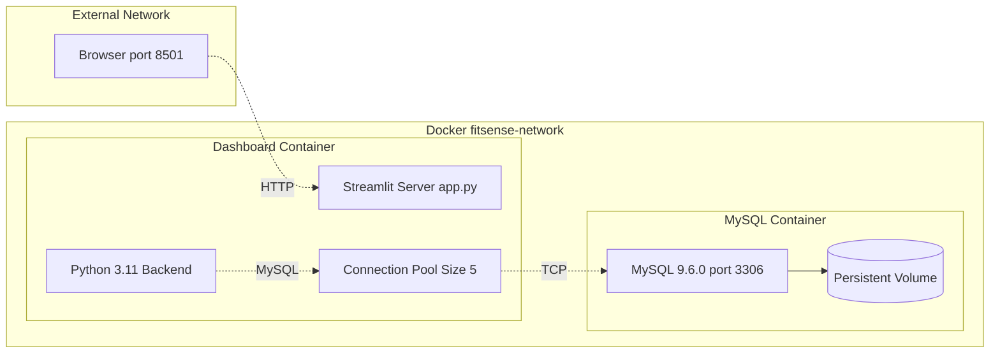
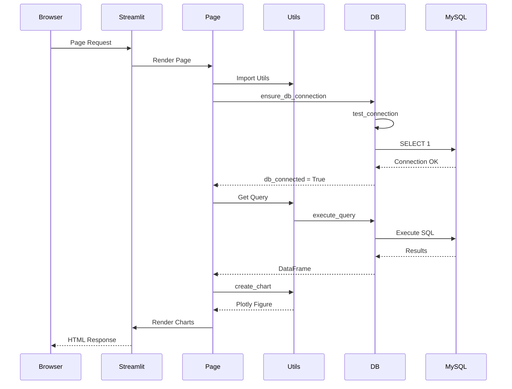
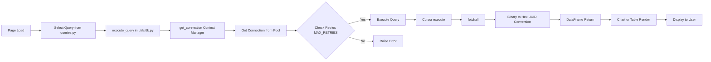
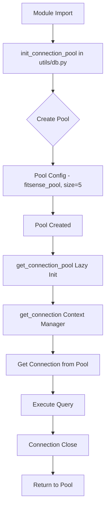

# FitSense AI Dashboard

A production-ready Streamlit-based data analysis dashboard for the FitSense AI MySQL database.

## Features

- **7 Dashboard Pages**: Overview, Workouts, Nutrition, Sleep, Weight, Users, and SQL Explorer
- **Interactive Visualizations**: Plotly-based charts with dark theme
- **SQL Query Console**: Execute custom queries with syntax highlighting
- **Authentication**: Google OAuth integration with demo mode
- **Performance Optimized**: Caching, connection pooling, and lazy loading
- **Mobile Responsive**: Works on desktop and tablet devices

## Architecture

The FitSense AI Dashboard follows a three-tier architecture pattern:



## Database Schema

The MySQL database contains 25 tables organized into 9 domains:


## Network Architecture



### Port Mappings

| Service             | Container Port | Host Port | Protocol |
| ------------------- | -------------- | --------- | -------- |
| Streamlit Dashboard | 8501           | 8501      | HTTP     |
| MySQL Database      | 3306           | 3306      | TCP      |

## Quick Start

### Prerequisites

- Python 3.10+
- MySQL 8.0+ (or Docker)
- pip

### Installation

1. **Clone the repository**

   ```bash
   cd fitsense-ai-dashboard
   ```

2. **Create virtual environment**

   ```bash
   python -m venv venv
   source venv/bin/activate  # On Windows: venv\Scripts\activate
   ```

3. **Install dependencies**

   ```bash
   pip install -r requirements.txt
   ```

4. **Configure environment**

   ```bash
   cp .env.example .env
   # Edit .env with your database credentials
   ```

5. **Run the dashboard**
   ```bash
   streamlit run app.py
   ```

## Docker Deployment

### Using Docker Compose (Recommended)

```bash
docker-compose up -d
```

This starts both the MySQL database and the dashboard.

### Using Docker Only

```bash
# Build the image
docker build -t fitsense-dashboard .

# Run with environment variables
docker run -p 8501:8501 \
  -e DB_HOST=mysql-host \
  -e DB_PORT=3306 \
  -e DB_USER=root \
  -e DB_PASSWORD=secret \
  -e DB_NAME=fitsense_ai \
  fitsense-dashboard
```

## Environment Variables

| Variable               | Description                | Default     |
| ---------------------- | -------------------------- | ----------- |
| `DB_HOST`              | MySQL host                 | localhost   |
| `DB_PORT`              | MySQL port                 | 3306        |
| `DB_USER`              | Database user              | root        |
| `DB_PASSWORD`          | Database password          | (none)      |
| `DB_NAME`              | Database name              | fitsense_ai |
| `DEMO_MODE`            | Enable demo login          | false       |
| `GOOGLE_CLIENT_ID`     | Google OAuth client ID     | (none)      |
| `GOOGLE_CLIENT_SECRET` | Google OAuth client secret | (none)      |
| `DEBUG`                | Enable debug mode          | false       |
| `DISABLE_CACHE`        | Disable query caching      | false       |

## Project Structure

```
fitsense-ai-dashboard/
├── app.py                 # Main entry point
├── pages/                 # Dashboard pages
│   ├── 1_Overview.py
│   ├── 2_Workouts.py
│   ├── 3_Nutrition.py
│   ├── 4_Sleep.py
│   ├── 5_Weight.py
│   ├── 6_Users.py
│   └── 7_SQL_Explorer.py
├── utils/                  # Utility modules
│   ├── db.py              # Database connection
│   ├── queries.py         # SQL queries
│   ├── charts.py          # Chart configurations
│   ├── sql_console.py     # SQL console
│   ├── auth.py            # Authentication
│   ├── cache.py           # Caching utilities
│   ├── error_handler.py   # Error handling
│   └── performance.py     # Performance utilities
├── assets/
│   └── style.css          # Custom CSS
├── tests/                 # Test suite
├── Dockerfile
├── docker-compose.yml
└── requirements.txt
```

## Code Flow

### Request Flow



### Query Execution Flow



### Database Connection Pool Flow



## Testing

```bash
# Run all tests
pytest

# Run with coverage
pytest --cov=. --cov-report=html

# Run specific test file
pytest tests/test_dashboard.py
```

## SQL Explorer Features

- **Predefined Queries**: Load common queries by category
- **Custom Queries**: Execute any valid SQL
- **Query History**: Track executed queries
- **Export**: Download results as CSV or JSON
- **Quick Charts**: Auto-generate visualizations

## Design System

The dashboard follows a dark-mode glassmorphism design:

- **Background**: #0F172A (dark slate)
- **Cards**: #1E293B with glass effect
- **Primary**: #3B82F6 (blue)
- **Secondary**: #F59E0B (amber)
- **Typography**: Inter/Roboto

## Deployment Options

### Streamlit Cloud

1. Push to GitHub
2. Connect to Streamlit Cloud
3. Set environment variables
4. Deploy

### Heroku

```bash
heroku create fitsense-dashboard
heroku container:push web
heroku container:release web
```

### AWS Elastic Beanstalk

```bash
eb init
eb create production
eb deploy
```

## Contributing

1. Fork the repository
2. Create a feature branch
3. Make your changes
4. Run tests
5. Submit a pull request

## License

MIT License - See LICENSE file for details

## Support

For issues and questions, please open a GitHub issue.
